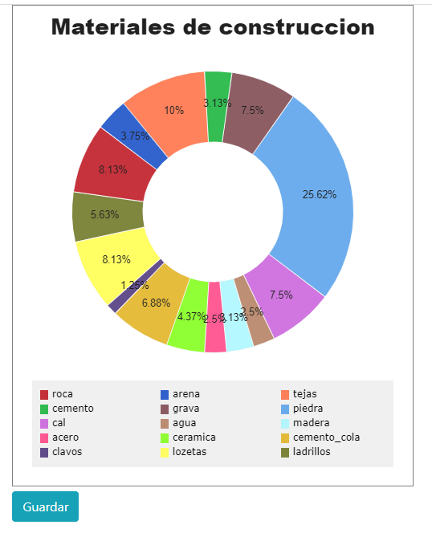
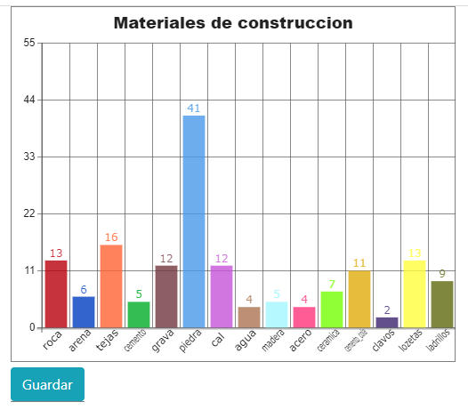
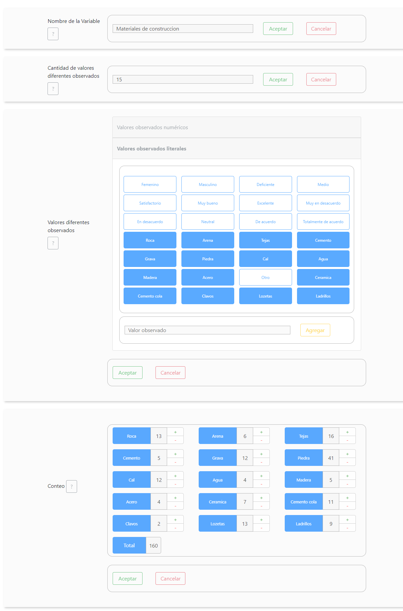
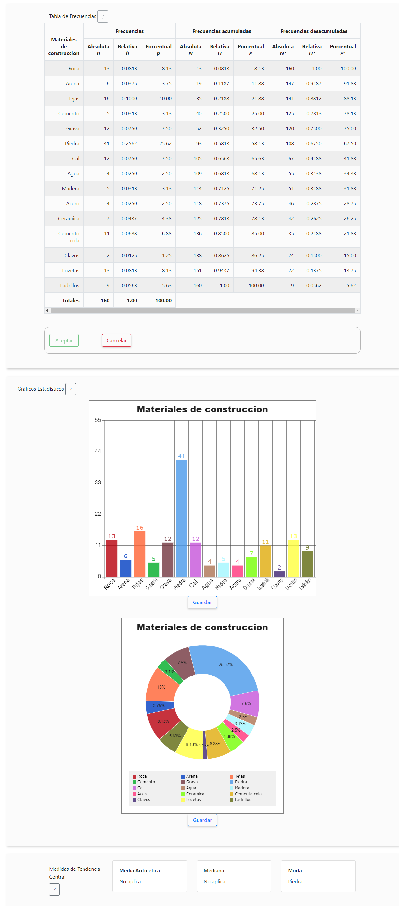

# Gráficos Estadísticos e implementación para datos no agrupados

Proyecto realizado para la materia de Estadística Aplicada (2018) de sistemas informáticos del ITSEC.

## Gráficos Estadísticos

Con la API Canvas de HTML5 y programacion orientada a objetos se realizó una pequeña libreria de graficos ([graficos.js](js/graficos.js)):

- Circular
- Anillo
- Barras
- Bastones

### Uso

#### En HTML

```html
<!-- index.html -->
<canvas id="mi-canva" width="500" height="600"></canvas>
<button class="..." id="boton">Guardar</button>
```

1. Definimos un elemento canvas (dar valor a los atributos width y height)

2. Un boton que permitirá realizar la descargar del gráfico (opcional)

#### En JS

##### Circular o Anillo

```js
// main.js
const miCanva = document.getElementById("mi-canva");
const boton = document.getElementById("boton");

// para gráfico circular cambiar a new Circular(...)
let anillo = new Anillo(miCanva, "Materiales de construccion", {
  roca: 8.13,
  arena: 3.75,
  tejas: 10.0,
  cemento: 3.13,
  grava: 7.5,
  piedra: 25.62,
  cal: 7.5,
  agua: 2.5,
  madera: 3.13,
  acero: 2.5,
  ceramica: 4.37,
  cemento_cola: 6.88,
  clavos: 1.25,
  lozetas: 8.13,
  ladrillos: 5.63
});

anillo.graficar();

// resalta el elemento
miCanva.addEventListener("mousemove", function () {
  anillo.animacion();
});

boton.addEventListener("click", function () {
  anillo.descargar();
});
```



##### Barras o Bastones

```js
// main.js
const miCanva = document.getElementById("mi-canva");
const boton = document.getElementById("boton");

// para gráfico de bastones cambiar a new Bastones(...)
let barras = new Barras(miCanva, "Materiales de construccion", {
  roca: 13,
  arena: 6,
  tejas: 16,
  cemento: 5,
  grava: 12,
  piedra: 41,
  cal: 12,
  agua: 4,
  madera: 5,
  acero: 4,
  ceramica: 7,
  cemento_cola: 11,
  clavos: 2,
  lozetas: 13,
  ladrillos: 9
});

barras.graficar();

// resalta el elemento
miCanva.addEventListener("mousemove", function () {
  barras.animacion();
});

boton.addEventListener("click", function () {
  barras.descargar();
});
```



## Implementación para datos no agrupados

Aplicación estadística para cálculo de frecuencias, gráficos y medidas de tendencia central para datos no agrupados.

### Dependencias

#### CSS

- Bootstrap v4.1.2

### JS

- jQuery v3.3.1
- Bootstrap v4.1.2
- [graficos.js](js/graficos.js) (libreria propia)

### Captura



